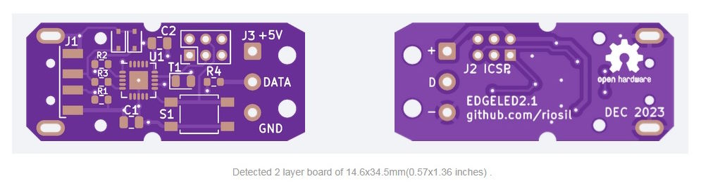

## Computer Aided Manufature

**KiCAD 7 Files**

Gerber files (plus assembly files optimised for [JLCPCB](https://jlcpcb.com)) are in the CAM the folder.

Recommended finish is ENIG, board thickness 1.6mm.

**There is no warranty that these files are error free (repo licence applies).**

*JLCPCB online pre-view*
