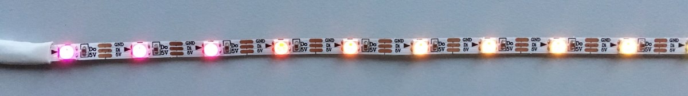

# EdgeLEDcontroller

Tiny controller for addressable LEDs in tiny spaces - ideal for engraved edge-lit acrylic displays.

This was made in Makespace, Cambridge. There is a 2-layer example at the end of this [video](https://www.instagram.com/p/CSuGmHmoO2C/).

The base is made of three layers of laser cut plywood with a laser engraved channel in the base for the LED strip. M3 nuts are embedded between the top two bonded layers. Alternatively the LED connections can be sealed with adhesive lined heat shrink tubing (4.8mm dia.) and [slide binders](https://www.amazon.co.uk/gp/product/B00JPJA7QY) used to clip the LEDs to the panel - ideal for hanging signs.

**Security:** by default the controller only takes power from the USB - it only requires a USB charger. If plugged into a computer, it will not enumerate as a USB device unless the on-board switch is held down as the plug is inserted.

*Version 2 board: 3-core cable and separate ICSP bootloader programming pins*

The cable is 4-wire flexible telephone extension cord (V1 board) or 3-core 28AWG cable, 3.5mm diameter (V2 boards). The maximum length is limited by cable capacitance, 2m maximum is recommended. It was found that using two ground wires does not improve performance.

The LEDs are type WS2812B (aka Neopixels) or SK6812 LEDs in 3.5mm square packages. The controller is built into a USB plug and programmed with Arduino sketches through USB. Having the controller built in the plug allows the LED strip to fit in very slim spaces.

The preferred LED strip, 4mm wide, is from [AliExpress](https://www.aliexpress.com/item/32889698964.html).

## Programming

The controller uses a ATtiny85 programmed with the [Micronucleus](https://github.com/micronucleus/) bootloader. The controller will only appear as a programmable device if the button (on PB0) is pressed as it is plugged into the USB host. Programs can then be loaded via USB using the Arduino IDE with board selection set to: "Digispark (Default - 16.5MHz)."

Install the board into the Arduino IDE by following these [instructions](http://digistump.com/wiki/digispark/tutorials/connecting) for the Digispark:

* File → Preferences → Additional Board Manager URLs, enter:  
http://digistump.com/package_digistump_index.json  
(separate multiple entries with commas)
* Tools → Board → Boards Manager, Filter on 'Digispark' then Install.  
Select the board: 'Digispark (Default - 16.5MHz)'.

Windows 10 users should follow the [Zadig driver installer guide](https://github.com/micronucleus/micronucleus/tree/master/windows_driver_installer). Linux and OS X users do not require custom drivers.

When creating Arduino sketches note the push button is on pin PB0 (active low) and the LED data is on pin PB1. To upload a sketch into the controller; click the Arduino IDE upload button, plug in the controller holding the push button down when this message appears (the button can be released after a second):

> Running Digispark Uploader...  
> Plug in device now... (will timeout in 60 seconds)

Space for user code is:

| Bootloader |Program space (bytes)|
|------------|---------------------|
| v1.02      | 6012                |
| v1.11      | 6330                |
| v2.04      | 6522                |
| v2.5       | 6586                |
| v2.6 (current) | 6586            |

Ready compiled bootloader hex files are in the [firmware](firmware/bootloader) folder. It should only be necessary to upload the bootloader either after construction or for an update (I have never seen a bootloader become corrupted).

**Tip1:** consider adjusting the maximum upload size as per these instructions: [Changing the maximum sketch size of the Arduino IDE](https://gist.github.com/Ircama/22707e938e9c8f169d9fe187797a2a2c#user-content-changing-the-maximum-sketch-size-of-the-arduino-ide) to ensure all program space is available.

**Tip2:** if bootloader v2.x is installed, assert PB3 low to prevent USB enumeration messages. See example sketch for details. Using bootloader 2.x gives user programs access to USB but this is disabled in all examples by asserting PB3 low in the setup section.

## Firmware Files

The example sketch *EdgeLED_Demo* uses the FadeLED library to smoothly cycle LEDs through their range of hues. Each press of the on-board switch steps through the colours of the rainbow, back to the rainbow fade. Uses 4720 bytes (72%) of program storage space, 137 bytes of dynamic memory.

The *Makespace* sketch for the Makespace logo display has [two rows of nine LEDs](https://raw.githubusercontent.com/riosil/EdgeLEDcontroller/master/images/sign_makespace.jpg) (LED zero nearest the cable entry). The default sequence rapidly fades up white light, then slowly increases colour saturation before going dark and starting over. Uses 4678 bytes (71%) of program storage space, 167 bytes of dynamic memory.

The *Heartbeat* sketch, similar to the previous example, simulates a beating heart using two stacked heart engravings, one slightly larger than the other (artwork not included for copyright reasons). Pulse rate varies with ambient light level.

## History

* 6 June 2019 - V1 board, 4-core cable (2 ground wires), optional SFH3710 phototransistor mod enables auto brightness. See comments in the example sketch.

* 9 June 2019 - issues found with recent releases of the FastLED library; version 3.2.7 fails to compile for the ATtiny85, version 3.2.8 uses 48% more program memory for the example sketch. Last known working version of FastLED is 3.2.6. Fixed with release 3.2.9.

* 9 Feb 2020 - FastLED is broken again with version 3.3.3, use version 3.3.2 until a fix is released.

* 13 Oct 2021 - FastLED 3.4 works OK. Added Micronucleus bootloader v2.5. Minor tweak to the example code.

* 29 Dec 2021 - Micronucleus bootloader v2.6. V2.0 board; now uses 3-core cable, moved pads for ICSP programming to separate connector (J2). Note missing ground on J2 pin 6 needs to be [added manually](images/manual_fix_v2.jpg).

* 4 Dec 2023 - V2.1 board; missing ground (J2) fixed, CAM files added.

---
*© Keep Calm styles, though used in the UK since 1939, may be copyright in the EEA/EU by Keep Calm and Carry On Ltd.*